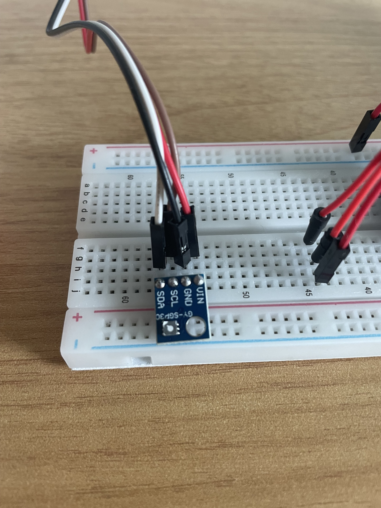
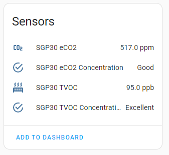

Home Assistant + Esp Home project to assess various air quality sensors

### Board
Esp32 Wroom Development Board

### Components
|Type|Name| Wiring| Voltage | Link
|--|--|--|--|--
|Sensor |SGP30| I²C | 3.3V |[more](https://esphome.io/components/sensor/sgp30.html)

### How human readable values are calculated
CO2: [link1](https://www.co2meter.com/blogs/news/high-carbon-dioxide-co2-levels-indoors), [link2](https://www.kane.co.uk/knowledge-centre/what-are-safe-levels-of-co-and-co2-in-rooms),  [TVOC](https://learn.kaiterra.com/en/resources/understanding-tvoc-volatile-organic-compounds)
  
### Notes
My particular sensor from AliExpress doesn't wotk with 5V, had to put it on 3.3V.
Also if i am adding another device to I2C bus it is failing to initialize.
Probably this is related to issue described [here](https://github.com/nkitanov/iaq_board/issues/10)
As a workaround bound it to separate ESP32 and switched to SGP41.

### How it looks

