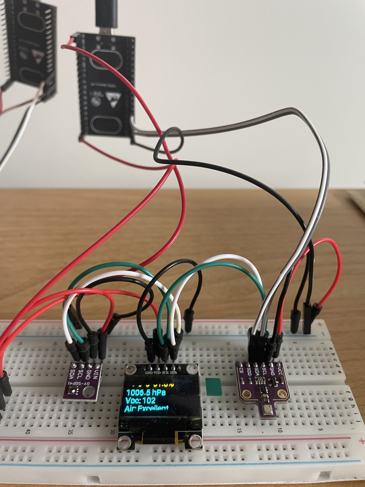
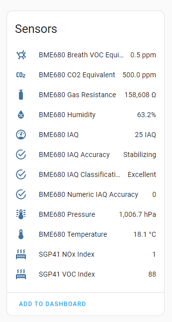

Home Assistant + Esp Home project to assess various air quality sensors

### Board 
Esp32 Wroom Development Board

### Components
|Type|Name| Wiring| Voltage | Link 
|--|--|--|--|--
|Sensor |BME680 + BSEC| I²C | 5v |[more](https://esphome.io/components/sensor/bme680_bsec.html) 
|Sensor|SGP41| I²C | 3.3v | [more](https://esphome.io/components/sensor/sgp4x.html) 
|Display|SSD1306| I²C | 3.3v | [more](https://esphome.io/components/display/ssd1306.html) 

### How it looks

