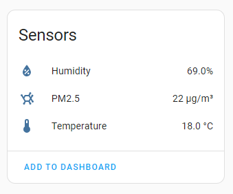
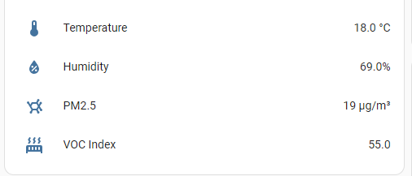

Ikea has zigbee [Air Quality Sensor](https://www.ikea.com/ie/en/p/vindstyrka-air-quality-sensor-smart-40498234) sensor for €40.
It reports 
 - Temperature (no decimal)
 - Humidity
 - PM2.5 concentration
 - tVOC arrow. 
Actual value of tVOC index is not shown on display and not reported via Zigbee by default.


However it is possible to read and display actual reading of this sensor with the help of zha_toolkit and small automation. You need to have [zha_toolkit installed](https://github.com/mdeweerd/zha-toolkit) on your Home Assistant first. Then you can create following automation:
```
alias: "Climate: Fetch tVOC data IKEA AQI"
description: poll for AQI data
trigger:
  - platform: time_pattern
    seconds: /59
condition: []
action:
  - parallel:
      - repeat:
          for_each:
            - ikea_of_sweden_vindstyrka
          sequence:
            - service: zha_toolkit.attr_read
              data:
                ieee: sensor.{{ repeat.item }}_pm2_5
                endpoint: 1
                manf: 4476
                cluster: 64638
                attribute: 0
                state_id: sensor.{{ repeat.item }}_voc_index
                allow_create: true
mode: single
```
The automation will create new entity `ikea_of_sweden_vindstyrka_voc_index` in Home Assistant, which you can add to the dashboard later.  At the end dasboard may look like this.



### Note
tVOC index is reported in the range 0-500 which is the same as SGP41 range,  Seems same sensor type is used in Ikea's device.
Here is an output from `zha_toolkit.scan_device` script for tVoc cluster
```
        "0xfc7e": {
          "cluster_id": "0xfc7e",
          "title": "Manufacturer Specific",
          "name": "manufacturer_specific",
          "attributes": {
            "0x0000": {
              "attribute_id": "0x0000",
              "attribute_name": "0",
              "value_type": [
                "0x39",
                "Single",
                "Analog"
              ],
              "access": "READ|REPORT",
              "access_acl": 5,
              "manf_id": 4476,
              "attribute_value": 231.0
            },
            "0x0001": {
              "attribute_id": "0x0001",
              "attribute_name": "1",
              "value_type": [
                "0x39",
                "Single",
                "Analog"
              ],
              "access": "READ|REPORT",
              "access_acl": 5,
              "manf_id": 4476,
              "attribute_value": 0.0
            },
            "0x0002": {
              "attribute_id": "0x0002",
              "attribute_name": "2",
              "value_type": [
                "0x39",
                "Single",
                "Analog"
              ],
              "access": "READ|REPORT",
              "access_acl": 5,
              "manf_id": 4476,
              "attribute_value": 500.0
            }
          },
          "commands_received": {},
          "commands_generated": {}
        }
      },
```
We can determine range from attributes 1 and 2 values which is 0.0 and 500.0. Actual tVOC value comes in attribute 0 value which is 231.0 in the json.
