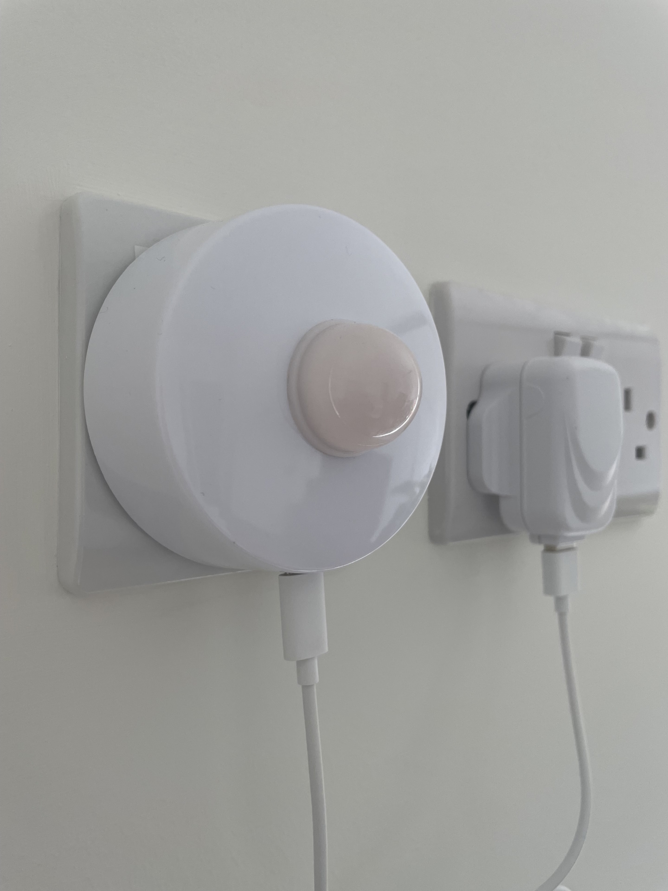
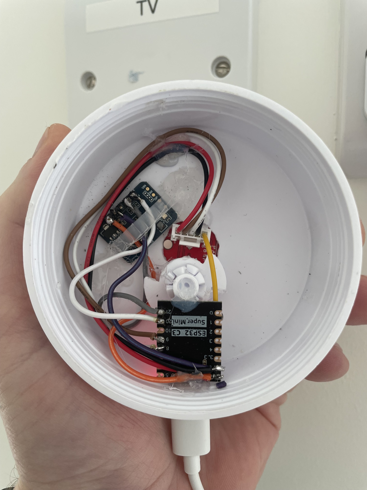
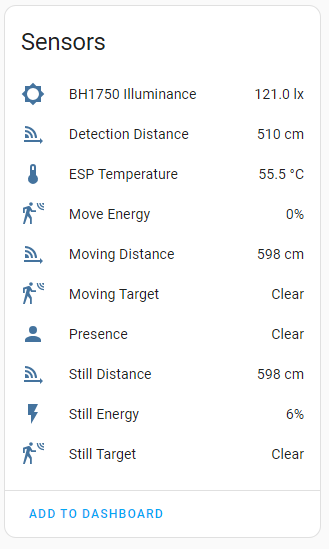

Home Assistant + Esp Home project to assess various air quality sensors

### Board
ESP32-C3 160MHz, 320KB RAM, 4MB Flash

### Components
|Type|Name| Wiring| Voltage | Link
|--|--|--|--|--
|Sensor |LD2410| UART | 5V |[more](https://esphome.io/components/sensor/ld2410.html?highlight=ld2410)
|Sensor |BH1750FVI| I²C| 5V |[more](https://esphome.io/components/sensor/bh1750.html?highlight=bh1750)

  
### Notes
Current firmware of LD2410 is not good enough to catch presence of still objects, this issue is described [here](https://www.youtube.com/watch?v=dAzHXpP3FcI&t=611s)
BH1750FVI works perfectly fine.

### How it looks

